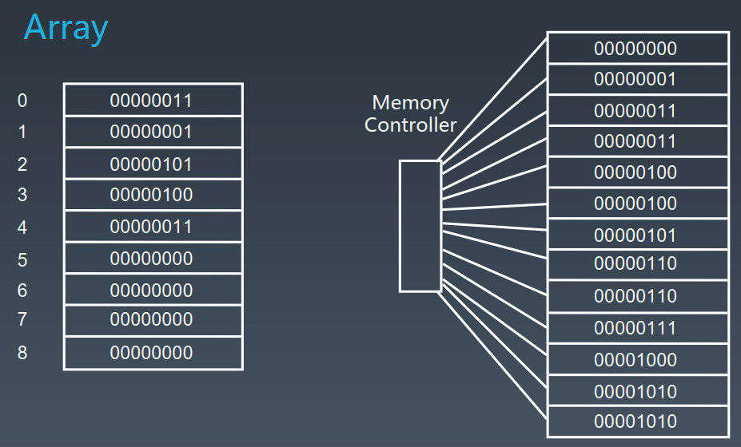
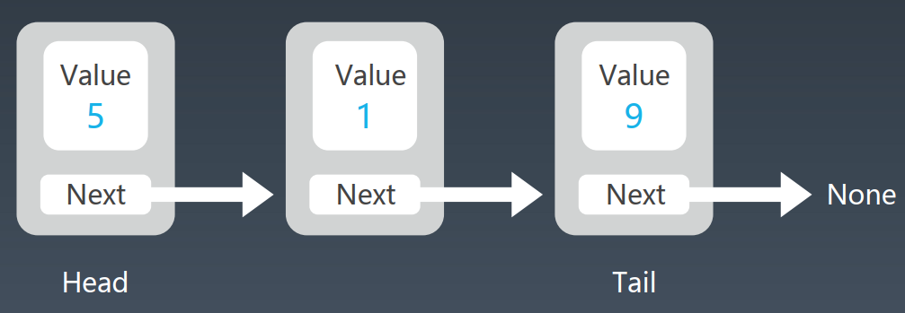
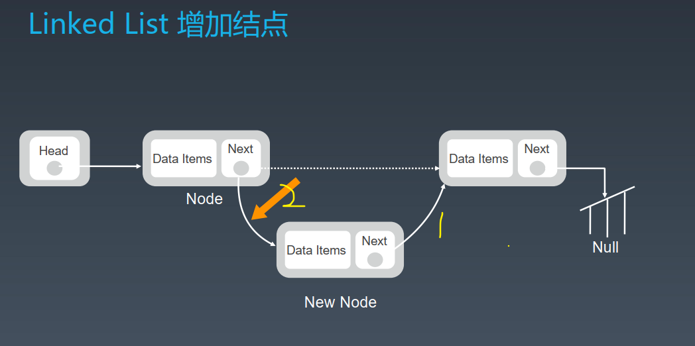
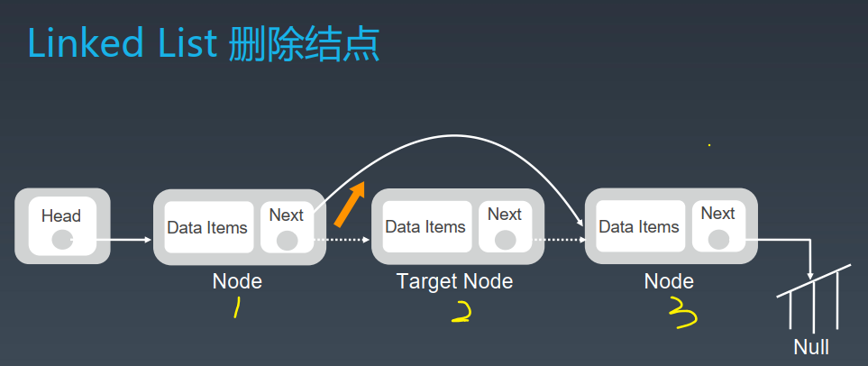
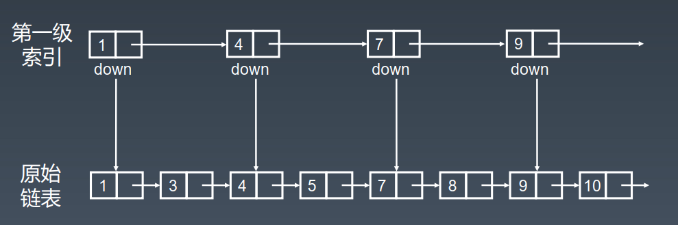
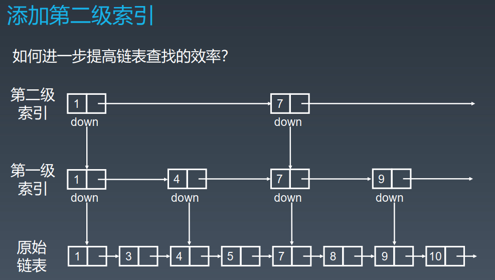
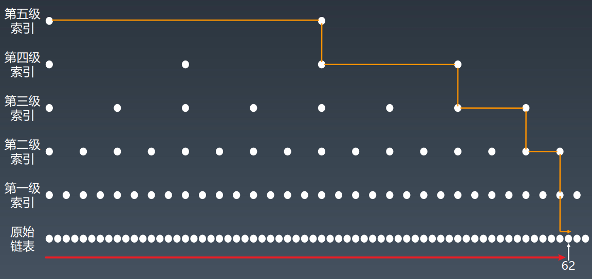
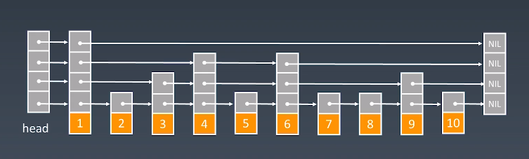
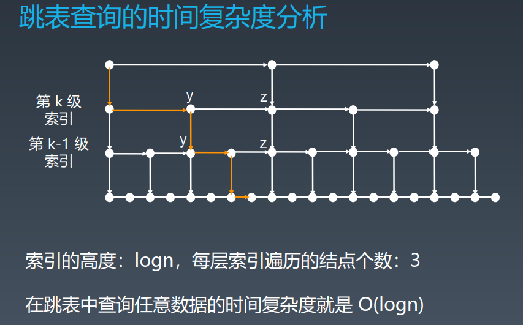

# 数组 array

## 抽象形式

如果在代码中申请了一个 _数组_ , 计算机就会在内存中分配一段 __连续__ 的地址给这个数组.



## 方法

1. 查询/遍历
2. 增加/删除

## 特性

- 优点：
	- 支持随机访问，访问元素时间复杂度为 O(1)
- 缺点：
	- 增加/删减元素时需要挪动目标位置后面的元素, 平均时间复杂度为 O(n)

# 链表 linked-list

## 抽象形式



## 方法

1. 查询

2. 增加/删除结点

   1. 增加结点示意图, 数字为顺序

      实际代码

      ```python
      New_node.next = Node.next
      Node.next = New_node
      ```

   2. 删除结点示意图, 直接 1.next = 3 即可
   
      代码
   
      ```python
      1.next = 1.next.next
      ```

## 特性

- 优点:
  - 增加/删除结点的操作, 相比于数组来说, 无需在内存中挪动大量的元素, 直接指向即可, 时间复杂度为 O(1).
- 缺点:
  - 不支持随机访问, 每次访问某个结点时需要遍历整个链表, 时间复杂度为 O(n).

## 时间复杂度 Array VS Linked-list

|                       | Array                                                   | Linked-list                                                  |
| --------------------- | :------------------------------------------------------ | ------------------------------------------------------------ |
| prepend(从头结点增加) | O(1) 备注:申请数组的时候在头部预留一些空间即可做到 O(1) | O(1)                                                         |
| append                | O(1)                                                    | O(1) 备注:此时间复杂度并不包含遍历到尾结点的时间 __此处理解可能有误__? |
| lookup                | O(1)                                                    | O(n)                                                         |
| insert                | O(n)                                                    | O(1)                                                         |
| delete                | O(n)                                                    | O(1)                                                         |

# skip-list 跳表

## 出现这种结构的原因?

针对链表存在**有序**的情况, 做出的进一步优化, 也可以说为了是进一步利用 **有序**这种特殊状态而研究出来的一种结构.

其思想主要是 空间换时间     升维

跳表(1989)对标的是平衡树(AVL)和二分查找, 插入/del/lookup都是 O(logn)

## 抽象形式

基本形式

也可以进一步"套娃"

## 跳表加速原始链表的直观示意图

橙色线只需经过5个结点就可以到达62

红色线需要经过61个结点才能到达62


## 特性

- 优点:
  - 针对有序链表, 大大提高了查询速度
- 缺点:
  - 现实应用中, 跳表由于元素的增删, 可能会变得十分不工整
  - 维护成本高, 增加/删除元素都要重新更新一遍现有索引, 于是增/删的时间复杂度为 O(logn)

## 跳表的时间复杂度

以上图为例, 第一级结点数为 n/2, 第二级 n/4, ... , 第 k 级结点数为 n/(2^k)

假设一共有 k 级索引, 由于最高级的索引有 2 个结点, 因此 n/(2^k) = 2, 所以 k = log2(n) - 1  **此处不是很理解**



## 跳表的空间复杂度

原始链表有 n 个结点

如果每 2 个结点跳一次, 索引的总结点数为 $\frac{n}{2} + \frac{n}{4}+\frac{n}{8}+...+8+4+2$
如果每 3 个结点跳一次, 索引的总结点数为$\frac{n}{3} + \frac{n}{9}+\frac{n}{27}+...+9+3+1$
空间复杂度为 O(n)

# 工程应用

- linked-list: LRU cache
  - https://www.jianshu.com/p/b1ab4a170c3c
  - https://leetcode-cn.com/problems/lru-cache  
- Skip list: Redis
  - https://redisbook.readthedocs.io/en/latest/internaldatastruct/skiplist.html  
  - https://www.zhihu.com/question/20202931  