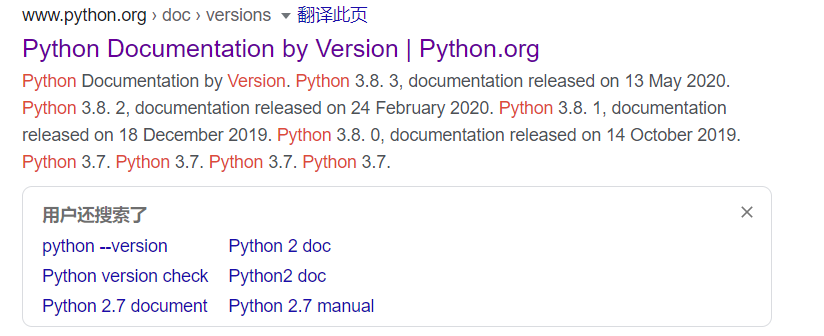
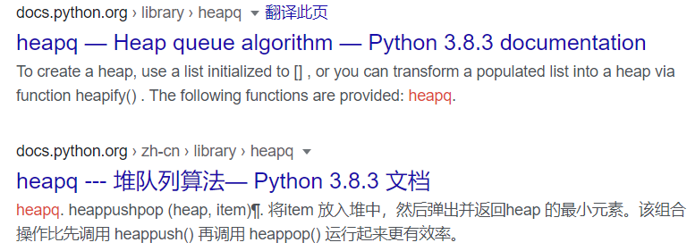

## API 是什么

## 查询方法

以查询 Python 源码为例

1. **google: latest python version**

   

2. **比如我们要查询 heapq 的文档, 就搜索 heapq python 3.8.3**

   

3. 文档中讲述了 python 中, heapq 模块定义了那些函数, 以及提供了基于这些函数的通用功能函数, 基本示例告诉了读者如何使用这些函数. https://docs.python.org/zh-cn/3/library/heapq.html

