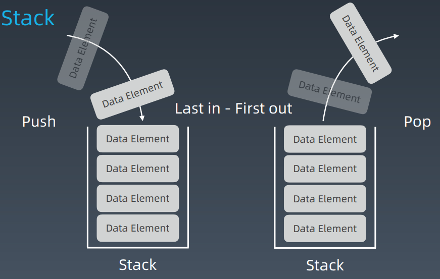
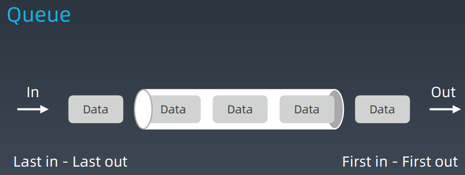
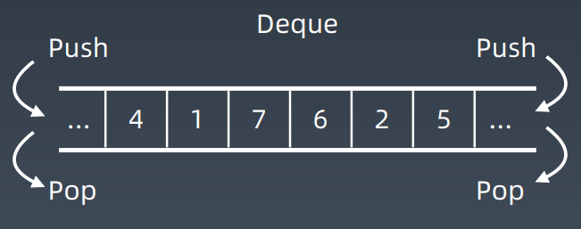

## 栈 stack

### 基本特性

- 先入后出 FILO、后入先出 LIFO
- 增/删  O(1)
- 查询 O(n)

## 队列 queue

### 基本特性

- 先入先出 FIFO, 后入后出 LILO
- 增/删 O(1)
- 查询 O(n)

## 双端队列 Deque (Double-End queue)

### 基本特性

- 增/删 O(1)
- 查询 O(n)

## 优先队列

### 基本特性

- 插入 O(1)
- **缺点:** 取出 O(logn) 按照元素优先级取出(VIP不用排队)
- **优点**: 不再是先入先出或者先入后出, 而是有优先级
- *注意*: 底层实现较为多样且复杂, 可以用 heap, bst, treap

 