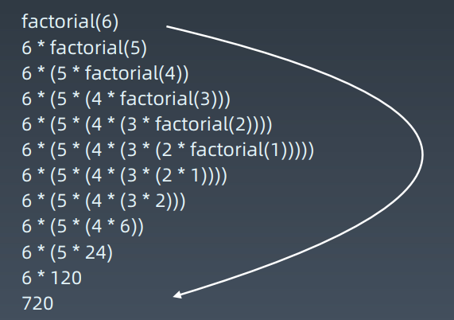

# 递归 Recursion

## 特点

- 递归本质上是一种循环
- 函数体不断的调用函数体本身来循环

## 理解/记忆方法

| 盗梦空间 | 递归 |
| ------- | ---- |
|向下进入更深层的梦境; 向上回到上一层梦境|向下进入不同的递归层, 向上回到原来的层(不能直接跳跃, 必须一层一层来)|
|通过声音同步回到上一层|用参数来进行传递函数不同的变量|
|每一层的环境, 周围的路人都是一份拷贝, 只有主角等人会穿越不同层次的梦境(发生变化 和 携带变化)|参数/全局变量可以在不同层之间穿越|

### 实例

计算 n! = 1 * 2 * 3 *... * n

```python
def Factorial(n):
	if n <= 1: return 1
	return n * Factorial(n - 1)
```



## 代码模板

python 代码模板

```python
def recursion(level, param1, param2, ...):
    # recursion terminator 递归终结条件
    if level > MAX_LEVEL:
        process_result
        return
    
    # process logic in current level 处理当前层逻辑
    process(level, data...)
    
    # drill down 下探到下一层
    self.recursion(level + 1, p1, ...)
    
    # reverse the current level status if needed 清理当前层
```

## 思维盲区

1. 不要人肉递归 (最大误区)
2. 找到最近最简方法, 拆解成可重复解决的子问题
3. 数学归纳法思维 

----------------------------------------------------------------------------------------------------------------------------------

# 分治

## 分治的思想

- 分治本质上是递归
- 多个子问题
- 组合子问题的结果

### 例子

**Problem**: 给定一串小写字母字符串, 需要全部转化成大写字母

**Divide**: 将字符串拆成一个一个单个字母

**Conquer**: 将单个字母转换成大写字母

**Merge**: 将所有大写字母合并

## 代码模板

python

```python
def divide_conquer(problem, param1, param2, ...):
	# revursion terminator
	if problem is None:
		print_result
		return
		
    # prepare data
    data = prepare_data(problem)
    subproblems = split_problem(problem, data)
    
    # conquer subproblems
    subresult1 = self.divide_conquer(subproblems[0], p1, ...)
    subresult2 = self.divide_conquer(subproblems[1], p1, ...)
    subresult3 = self.divide_conquer(subproblems[2], p1, ...)
    ...
    
    # process and generate the final result
    result = process_result(subresult1, subresult2, subresult3, ...)
```


# 回溯

## 回溯的思想

试错, 尝试分步解决一个问题,  在分步过程中,  当发现现有分步不能得到正确答案, 则回头取消上一步/上几步,  尝试其它可能的分步, 直到找到答案.

回溯法通常用递归来实现, 重复上述步骤后会出现两种情况:

1. 找到一个可能存在的正确答案
2. 尝试了所有情况, 宣告没有答案

最坏情况下, 时间复杂度为指数时间.

## 代码模板

递归的代码模板


