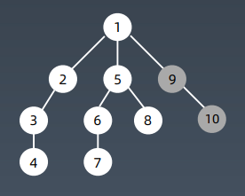
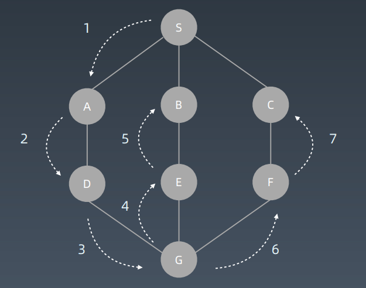
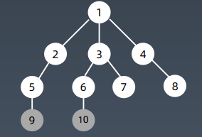

# 树/图的搜索-遍历

- 每个节点都要访问一次
- 每个节点仅访问一次
- 对于节点的访问顺序不同
  - 深度优先搜索: depth first search
  - 广度优先搜索: breadth first search
  - 优先级优先搜索: 应用于推荐算法等场景

# DFS

## 示例代码

### 套用递归模板

```python
def dfs(node):
    if node in visited:
        return
    
    visited.add(node)
    
    dfs(node.left)
    dfs(node.right)
```

### 代码模板

```python
visited = set()

def dfs(node, visited):
    visited.add(node)
    ...
    for next_node in node.children():
        if not next_node in visited:
            dfs(next_node, visited)
```

### 上面两个模板的合体(记忆这个)

```python
visited = set()
def dfs(node, visited):
    if node in visited: 
        return
    
    visited.add(node)
    for next_node in node.children():
        if not next_node in visited:
            dfs(next_node, visited)
```

### 非递归写法

```python
def dfs(self, tree):
    if tree.root is None:
        return []
    
    visited, stack = [], [tree.root]
    
    while stack:
        node = stack.pop()
        visited.add(node)
        
        process(node)
        noeds = generate_related_nodes(node)
        stack.push(nodes)
    
    ...其它工作
```


## dfs 的遍历顺序

树的遍历顺序(数字顺序即为遍历的顺序)



图的遍历顺序



# BFS

## bfs 的遍历顺序



## 代码模板

```python
def bfs(graph, start, end):
	queue = []
    queue.append([start])
    visited.add(start)
    
    while queue:
        node = queue.pop()
        visited.add(node)
        
        process(node)
        nodes = generate_related_nodes(node)
        queue.push(nodes)
        
    ...#other processing work
```


